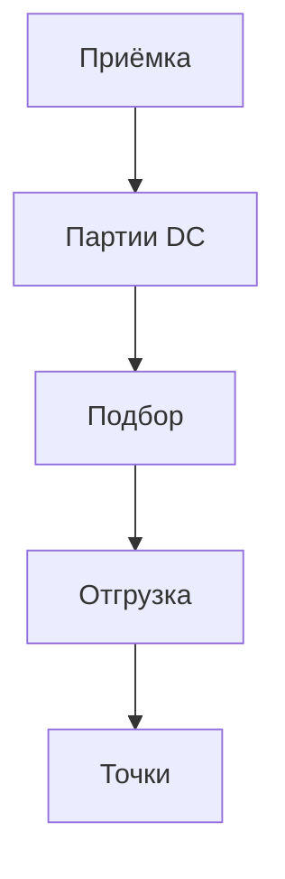

### Центральный склад / DC

**Назначение**: приёмка, хранение и отгрузка на точки, кросс-докинг.

**Функции**
- Приёмка и партии, хранение, адресное размещение
- Подбор заказов точек, волновая отгрузка
- Кросс-докинг для скоропортящихся

### Схема

### Роли
- DC Manager, Warehouse Operator, Logistics

