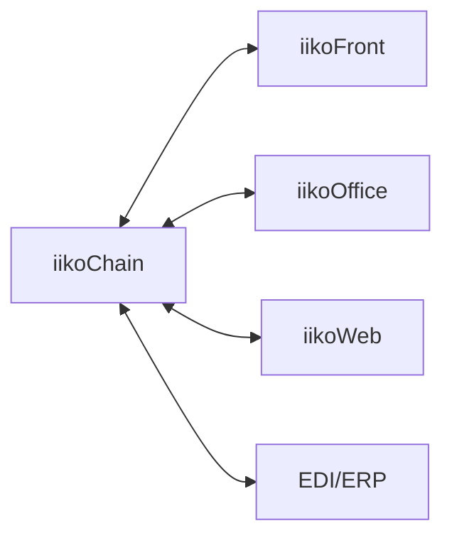

### Интеграции

**Назначение**: обмен с iikoFront (точки), iikoOffice, iikoWeb и внешними системами (EDI/ERP).

**Каналы**
- Публикации меню/цен/акций на точки (iikoFront)
- Продажи/остатки с точек в DWH
- EDI: прайсы, заказы, ASN, накладные
- ERP/финансы: справочники, проводки, отчёты

### Схема

### Контроль
- Логи обмена, ретраи, мониторинг SLA

