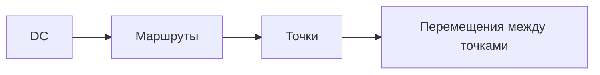

### Логистика и пополнение

**Назначение**: пополнение точек из DC, межмагазинные перемещения, расписания поставок.

**Функции**
- Маршрутизация, окна доставки, календари
- Расчёт потребности и автоматическое пополнение
- Межмагазинные перемещения (MMT)

### Схема

### Роли
- Logistics Planner, Region Manager

