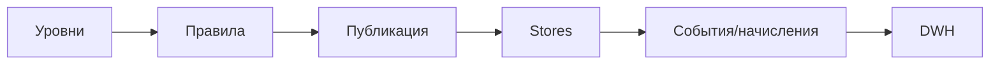

### Лояльность сети

**Назначение**: централизованные правила начисления/списания, уровни, кросс-точечные балансы.

**Функции**
- Уровни и статусы, сегментация
- Общий баланс по сети, антифрод-правила
- Интеграция с акциями и POS

### Схема

### Роли
- Loyalty Manager, Marketing, IT Integrations

