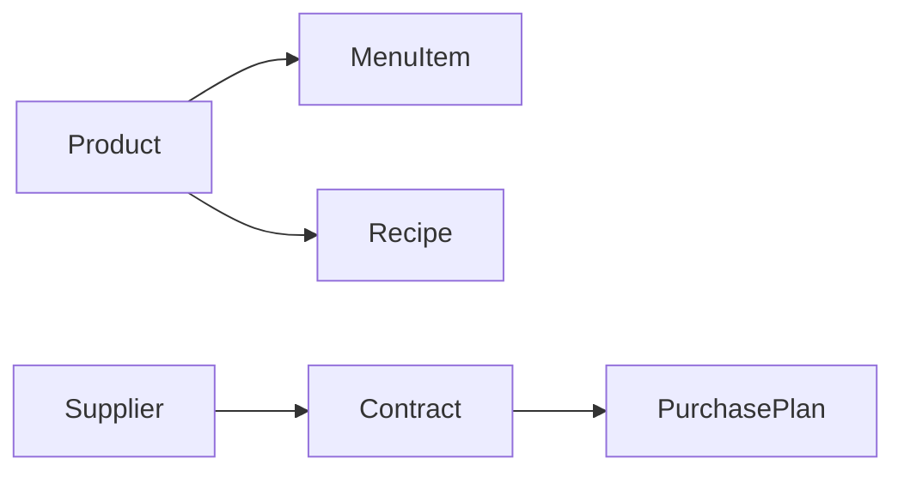

### Мастер-данные (MDM)

**Назначение**: единый источник правды для справочников сети.

**Состав**
- Номенклатура: `Product`, `Unit`, `Category`, атрибуты
- Налоги/ставки, валюты, параметры округления
- Поставщики и контракты

### Схема

### Сценарии
- Импорт/версионирование справочников
- Валидация связей перед публикацией
- Распространение на бренды/регионы

### Роли
- MDM Manager, Technologist, Auditor

