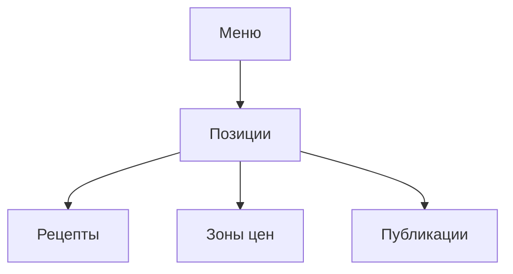

### Меню и рецептуры

**Назначение**: централизованное меню, техкарты, доступность и атрибуты.

**Функции**
- Иерархия меню, версии, дата-ввода
- Рецептуры и калькуляция себестоимости
- Матрица доступности по брендам/регионам/точкам

### Схема

### Сценарии
- Создать новую позицию и рецепт, назначить зоны цен
- Подготовить публикацию на выбранные точки

### Роли
- Brand Manager, Technologist, Approver

