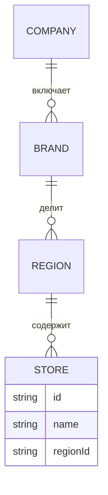

### Организационная структура

**Назначение**: модель сети — юридические лица, бренды, регионы, точки, а также их иерархия и права.

**Функции**
- Создание брендов и регионов, назначение точек
- Шаблоны настроек для бренда/региона (наследование)
- Разделение доступа франчайзи

### Схема

### Сценарии
- Добавить регион и распределить точки
- Установить брендовые политики, унаследовать на регионы
- Ограничить доступ франчайзи только своим точкам

### Роли
- HO Admin, Region Manager, Franchise Owner (read-only вне своей зоны)

