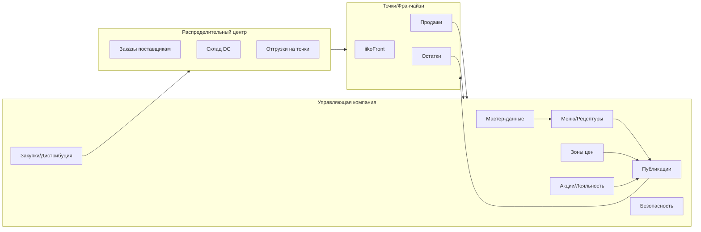

### Обзор iikoChain

**Назначение**: централизованное управление сетью и франшизой: мастер-данные, меню и цены, зоны цен, публикации на точки, централизованные закупки и логистика, акции и лояльность, консолидация продаж и отчётность. Основано на документации iikoChain [Getting Started](https://ru.iiko.help/articles/#!iikochain-9-x/getting-started).

**Кому**: управляющая компания, бренд-менеджеры, технологи, закупки, логистика, IT/интеграции, аудит/безопасность.

**Ключевые возможности**
- Центральные справочники и наследование на бренды/регионы
- Управление меню, рецептами, ценами и зонами цен
- Публикации изменений и контроль применения на торговых точках
- Контракты поставок, план закупок, распределительный центр
- Логистика и пополнение, межмагазинные перемещения
- Единые акции и лояльность по сети/сегментам
- Консолидация продаж, контроль остатков и отчёты по сети

### Архитектура (уровни)

### Основные сущности
- Организация: `Company`, `Brand`, `Region`, `Store`
- Мастер-данные: `Category`, `Product`, `Unit`, `Tax`, `Supplier`
- Меню/цены: `MenuItem`, `Recipe`, `PriceZone`, `PriceList`, `Publication`
- Лояльность/акции: `Campaign`, `Segment`, `Rule`
- SCM/логистика: `Contract`, `PurchasePlan`, `PurchaseOrder`, `Shipment`, `DistributionTask`
- Отчёты: `SalesAggregate`, `StockSnapshot`

### Роли
- Head Office Admin, Brand Manager, Technologist
- Procurement Manager, DC Manager, Logistics
- Region Manager, Franchise Owner (ограниченное окно)
- Security/Auditor

