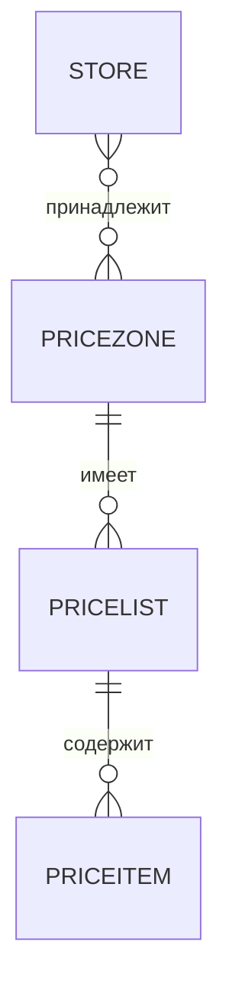

### Зоны цен и прайс-листы

**Назначение**: управление ценами по регионам/точкам, валютам и правилам округления.

**Функции**
- Создание `PriceZone`, назначение точек
- Прайс-листы по зонам, массовые изменения
- Политики округления и даты действия

### Схема

### Сценарии
- Настроить зоны цен по регионам и опубликовать прайс-листы
- Пересчитать цены на основе целевой наценки

### Роли
- Pricing Manager, Brand Manager

