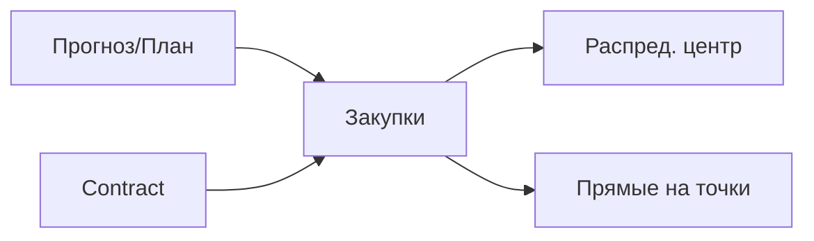

### Закупки и контракты

**Назначение**: централизованные контракты, план закупок и заказы поставщикам (DC/прямые).

**Функции**
- Контракты поставок, SLA, цены
- План закупок на основе прогнозов и остатков
- Волновые заказы и распределение по DC/точкам

### Схема

### Сценарии
- Сформировать план закупок на неделю по сети
- Разделить поставки: часть через DC, часть прямые

### Роли
- Procurement Manager, DC Manager

