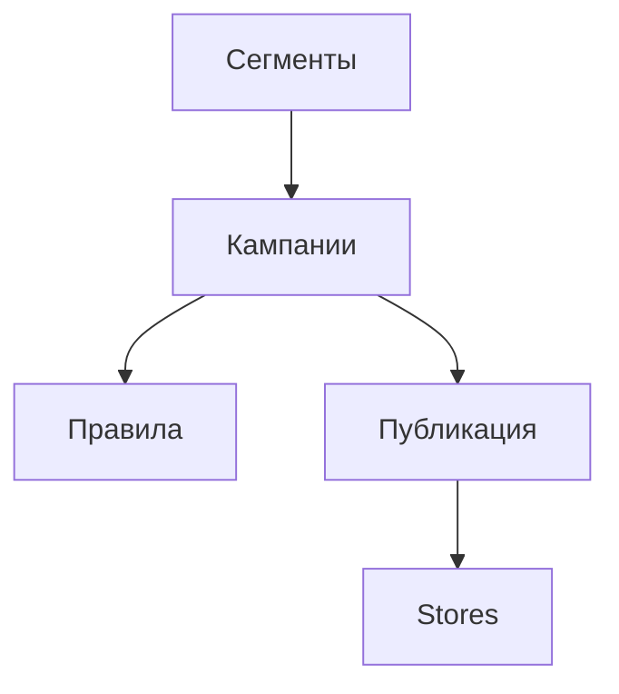

### Акции и лояльность сети

**Назначение**: единые правила скидок, кампаний и программ лояльности по сети.

**Функции**
- Конструктор правил (условия/действия), сегменты
- Гео- и бренд-таргетинг, даты действия
- Публикация на точки, отчётность по эффективности

### Схема

### Сценарии
- Создать акцию для регионов, исключить франчайзинговые точки
- Настроить тестовую группу и измерить uplift

### Роли
- Marketing Lead, Brand Manager, Approver

