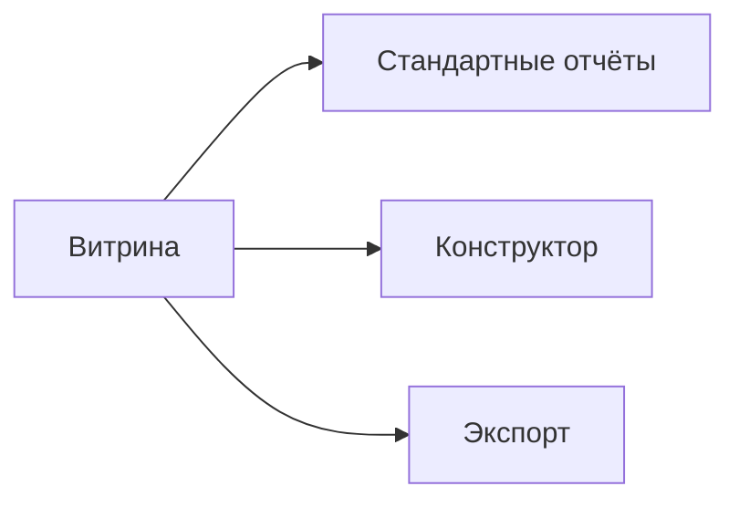

### Отчётность сети

**Назначение**: агрегированные отчёты по продажам, остаткам, акциям, соблюдению публикаций.

**Типы**
- Выполнение публикаций (compliance)
- Продажи по брендам/регионам/точкам
- Эффективность акций, ABC/XYZ, оборачиваемость

### Схема

### Экспорт
- XLSX/CSV/JSON, подписки, API для BI

