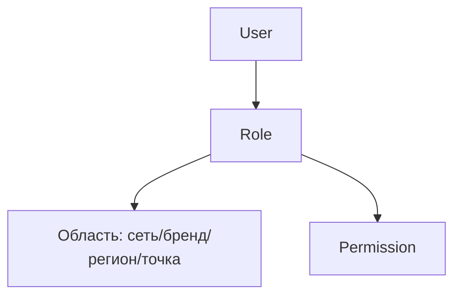

### Безопасность и роли (сеть/франшиза)

**Назначение**: разграничение доступа между управляющей компанией, регионами и франчайзи.

**Функции**
- Роли по уровням: сеть → бренд → регион → точка
- Окна данных для франчайзи (только свои точки)
- Аудит публикаций и критических изменений

### Схема RBAC

### Политики
- SoD (создание ≠ утверждение ≠ публикация)
- MFA для критических операций

