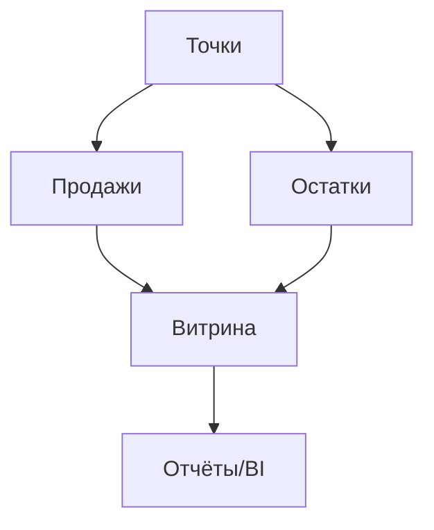

### Консолидация остатков и продаж

**Назначение**: единое окно по остаткам и продажам сети, мониторинг дефицита.

**Функции**
- Централизованная витрина `SalesAggregate`, `StockSnapshot`
- Критические остатки и автоуведомления
- Экспорт для BI/финансов

### Схема

### Роли
- Analytics, Finance, Region Manager

