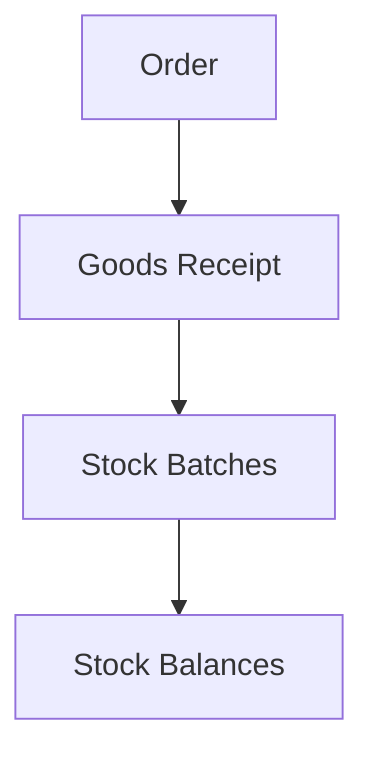

### Поступления (приёмка)

**Назначение**: оприходование товара по заказам или вне заказа.

**Функции**
- Создание поступления со ссылкой на заказ или свободное
- Сверка по позициям, расхождения по цене/количеству
- Формирование партий (`StockBatch`), даты и сроки годности
- Финализация: проводки на склад, печатные формы

### Схема

### Валидации
- Нельзя принять сверх разрешённого отклонения
- Обязателен срок годности для скоропортящихся

