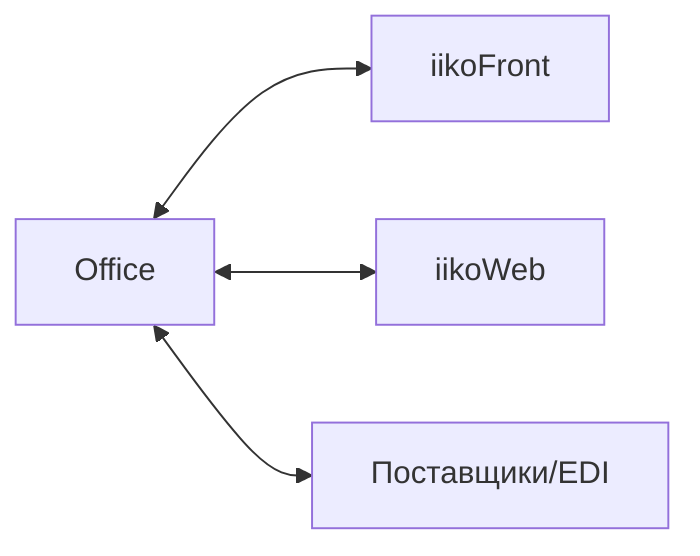

### Интеграции

**Назначение**: обмен данными с POS, веб-модулями и внешними системами.

**Каналы**
- Синхронизация с iikoFront: продажи, списания по рецептам, справочники
- iikoWeb: аналитика, онлайн-каналы
- Внешние API/EDI: заказы, прайсы, каталоги

### Схема

### Контроль качества данных
- Журналы обмена, ретраи, алерты
- Версионирование справочников

