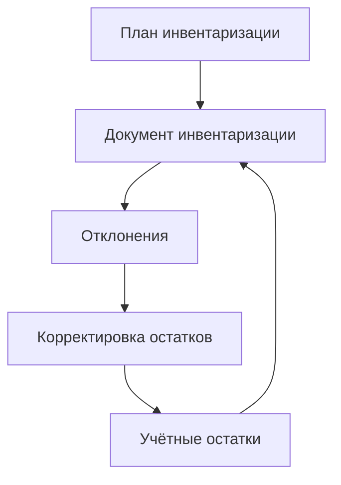

### Инвентаризация

**Назначение**: переоценка фактических остатков и их выверка.

**Функции**
- Планирование и проведение инвентаризаций (полная/выборочная)
- Ввод факта: вручную, сканером, импорт из XLS
- Автовычисление отклонений, пересчёт в базовые единицы
- Завершение: корректировка остатков, отчёты

### Схема

### Валидации
- Период закрыт — инвентаризация запрещена
- Нельзя завершить при незаполненных позициях

