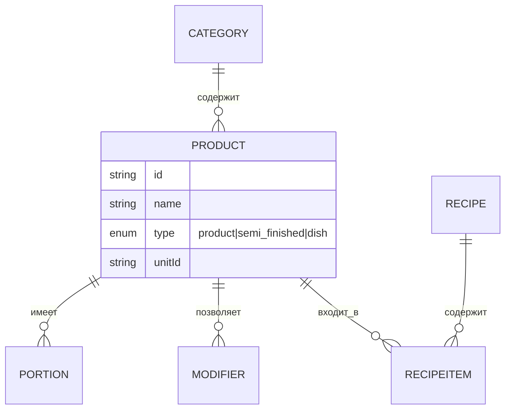

### Номенклатура и меню

**Назначение**: ведение ассортимента — продукты, полуфабрикаты и блюда. База для рецептур и производства.

**Основные функции**
- Создание карточек товаров и блюд
- Иерархия категорий, теги, атрибуты (аллергены, бренд)
- Порции и модификаторы (варианты подачи, добавки)
- Учётные параметры: единицы, фасовка, потери, кул. выход
- Ценообразование: базовые цены, наценки, цена продажи (по необходимости)

### Структура страницы
- Дерево категорий
- Список номенклатуры с фильтрами и быстрым поиском
- Карточка элемента: общие сведения, учёт, цены, связи (рецепты, поставщики)

### Схема

### Сценарии
- Импорт номенклатуры из Excel/CSV
- Массовое редактирование цен и атрибутов
- Архивация позиций, аудит изменений

### Роли
- Технолог: создание и изменение
- Управляющий: утверждение, публикация
- Кладовщик: только чтение

