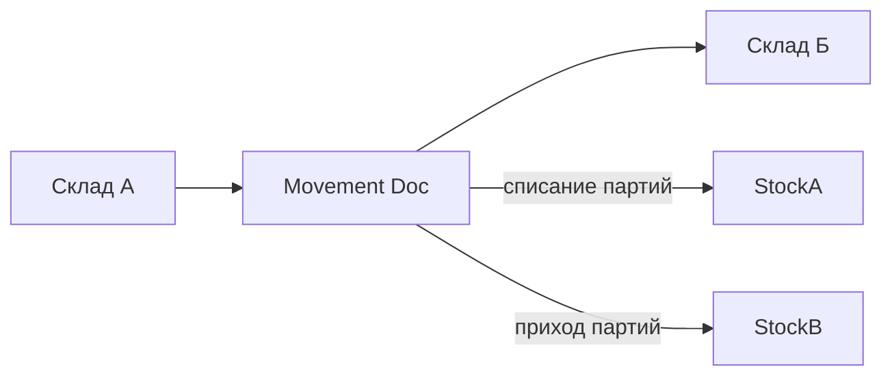

### Перемещения

**Назначение**: перемещение товаров между складами/подразделениями.

**Функции**
- Документ перемещения: склад-источник, склад-получатель
- Резервирование партий, печать накладной, статусный цикл

### Схема

### Валидации
- Нельзя перемещать ниже нуля
- Запрет перемещений по закрытому периоду

