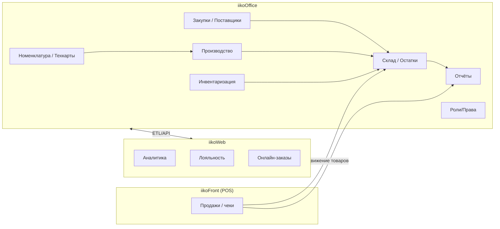

### Обзор iikoOffice

**Назначение**: iikoOffice — бэк-офис для управления сетью ресторанов: номенклатура и рецептуры, закупки и склад, производство, инвентаризация, поставщики, ценообразование и отчётность. Синхронизируется с iikoFront (POS) и iikoWeb (веб-модули аналитики, маркетинга и e-com).

**Для кого**: операционные директора, технологи, кладовщики, бухгалтерия, закупки, управляющие.

**Ключевые возможности**:
- Управление номенклатурой: продукты, полуфабрикаты, блюда, модификаторы, порции
- Рецептуры и себестоимость: техкарты, нормы расхода, калькуляции, переоценки
- Закупки и поставщики: заказы, поступления, цены, условия
- Склад: учёт остатков, партии/сроки, перемещения, списания, инвентаризация
- Производство: план-задания, выпуск, потребление
- Отчётность: складская и управленческая
- Безопасность: роли, права, аудит

### Архитектура на уровне контуров

### Общая модель данных (сущности)
- Номенклатура: `Product`, `Dish`, `SemiFinished`, `Modifier`, `Portion`, `Category`, `Unit`
- Рецептуры: `Recipe`, `RecipeItem`, `Yield`, `WasteRules`
- Склады: `Store`, `StockBatch`, `StockBalance`, `InventoryDoc`, `WriteOffDoc`, `MovementDoc`
- Закупки: `Supplier`, `PriceList`, `PurchaseOrder`, `GoodsReceipt`
- Производство: `ProductionTask`, `ProductionIssue`, `Consumption`
- Продажи: `Sale`, `SaleItem`, `Return`
- Безопасность: `User`, `Role`, `Permission`, `AuditLog`

### Роли и права (высокоуровнево)
- Технолог: номенклатура, техкарты, себестоимость
- Кладовщик: поступления, перемещения, списания, инвентаризация
- Закупщик: поставщики, заказы, цены
- Управляющий: контроль показателей и утверждения
- Бухгалтер/финансы: отчётность, сверки
- Администратор: пользователи, роли, интеграции

### Связанные страницы
- `settings.md` — базовые справочники и параметры
- `menu.md`, `products.md`, `recipes.md`, `modifiers.md`, `portions.md`
- `suppliers.md`, `purchase-orders.md`, `arrivals.md`
- `stock.md`, `movements.md`, `writeoffs.md`, `inventory.md`
- `production.md`
- `reports.md`, `integrations.md`, `security.md`

