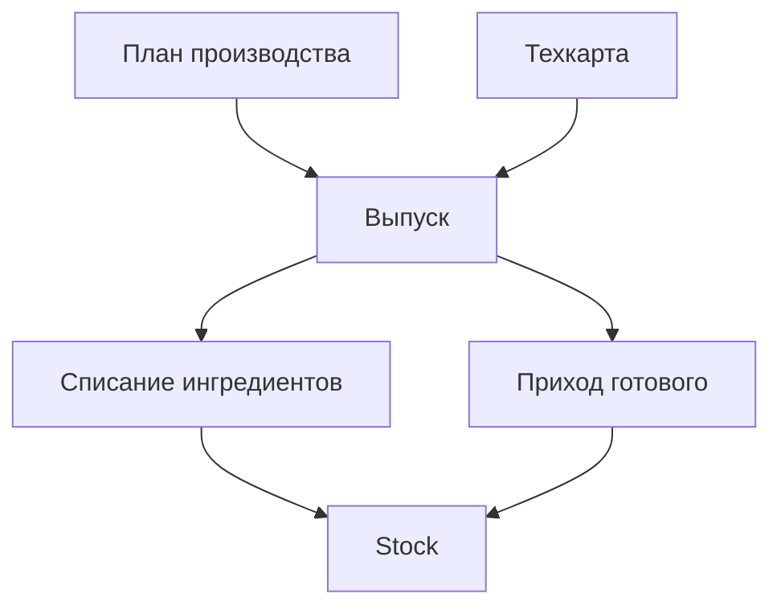

### Производство

**Назначение**: выпуск полуфабрикатов и блюд на кухне/центральном производстве.

**Функции**
- План-задания по рецептам и порциям
- Списание ингредиентов и приход готовой продукции
- Поддержка альтернативных рецептур и замен

### Схема

### Роли
- Технолог: контроль рецептур
- Кладовщик/кухня: исполнение

