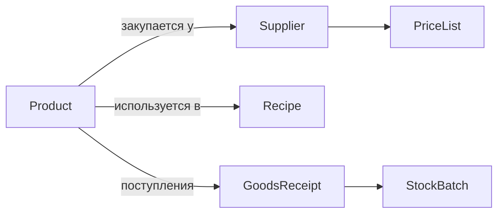

### Продукты и ингредиенты

**Назначение**: карточки сырья и полуфабрикатов, учётные параметры и источники снабжения.

**Ключевые поля карточки**
- Идентификатор, наименование, категория, штрихкоды
- Единица измерения, фасовка, коэффициенты
- Атрибуты: срок годности, условия хранения, потери
- Поставщики и упаковки: `Supplier`, минимальная партия, цена, валюта
- Соответствие для закупок: артикулы, коды у поставщика

### Схема

### Сценарии
- Добавление поставщика и упаковки к продукту
- Обновление цен через прайс-листы
- Замена продукта-аналога в рецептах

### Валидации
- Нельзя удалить продукт, если есть партии/остатки
- Изменение единицы — только через коэффициенты пересчёта

