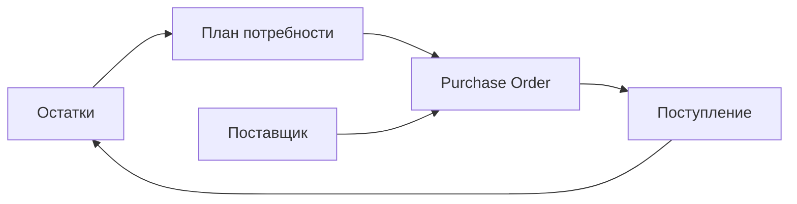

### Закупки: заказы поставщикам

**Назначение**: планирование и оформление заказов поставщикам.

**Функции**
- Создание заказа вручную или на основе минимальных остатков/прогнозов
- Подбор из прайс-листа, согласование цен и сроков
- Статусы: Черновик → На согласовании → Отправлен → Подтверждён → Закрыт
- Экспорт/отправка: EDI/Email, печатные формы

### Схема

### Валидации
- Проверка минимальных партий и кратности упаковок
- Контроль цен против прайс-листа

### Роли
- Закупщик: создание/отправка
- Управляющий: утверждение

