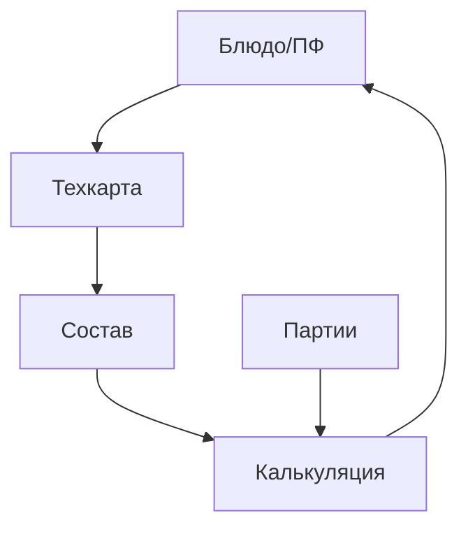

### Рецептуры и техкарты

**Назначение**: определение состава блюд/ПФ и расчёт себестоимости.

**Функции**
- Состав и нормы (`RecipeItem`), выход и потери, технологические операции
- Версионирование и дата-ввода-в-эксплуатацию
- Авторасчёт себестоимости по партиям/средневзвешенной
- Замены ингредиентов, аллокирование по складам

### Схема

### Сценарии
- Создать техкарту, добавить ингредиенты и потери
- Пересчитать себестоимость по последним поступлениям
- Сформировать печатную форму и утвердить

### Роли
- Технолог: полные права
- Управляющий: утверждение

