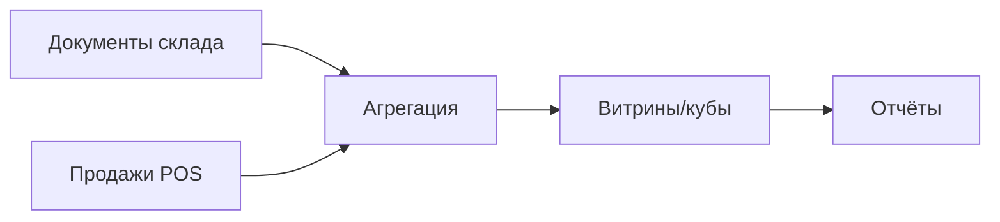

### Отчёты

**Назначение**: складские и управленческие отчёты по движению, остаткам и себестоимости.

**Типы отчётов**
- Движение ТМЦ по складам/категориям
- Остатки и сроки годности
- Себестоимость блюд и продуктов
- Сверка закупок и поступлений
- Отклонения инвентаризации

### Схема взаимодействий

### Экспорт
- XLSX/CSV, печатные формы, подписки (email)

