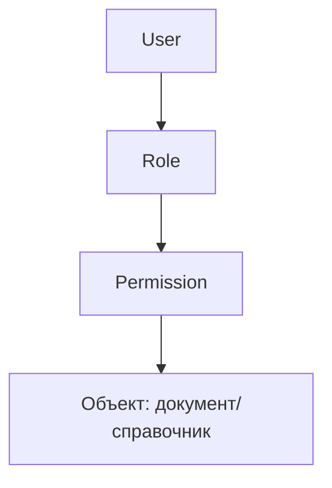

### Безопасность и доступы

**Назначение**: ролевая модель доступа и аудит действий.

**Функции**
- Роли и права на объекты: чтение/создание/изменение/утверждение/проведение
- Матрица доступа по складам и ресторанам
- Аудит изменений и критические операции

### Схема RBAC

### Политики
- Разделение обязанностей (SoD): закупки ≠ приёмка ≠ списания
- Двухфакторное подтверждение для критических действий (по возможности)

