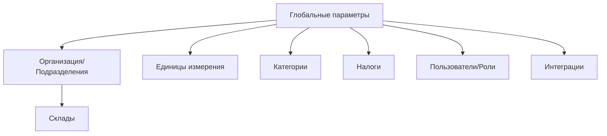

### Настройки и справочники

**Назначение**: централизованные параметры компании, справочники и базовые настройки учёта.

**Основные разделы**
- Организация: юридические лица, подразделения, рестораны, склады (`Store`), кассы
- Единицы измерения (`Unit`): базовые и производные, коэффициенты
- Категории номенклатуры (`Category`): товары, блюда, полуфабрикаты
- Налоги и ставки: НДС/VAT, сервисные сборы, округления
- Пользователи, роли, права: RBAC, группы, аудит
- Интеграции: обмен с iikoFront/iikoWeb, внешние API, выгрузки

### Схема страницы

### Модель данных и валидации
- `Store`: уникальный код, валюта, тип (кул., бар, центральный)
- `Unit`: базовая единица, коэффициент пересчёта; запрет удаления, если используется
- `Category`: древовидная структура, ограничения по типам
- `Tax`: период действия, ставки; контроль пересекающихся периодов
- `User`/`Role`/`Permission`: RBAC, аудит изменений

### Сценарии
- Создание склада и привязка к ресторанам
- Настройка единиц и коэффициентов
- Импорт категорий
- Создание ролей и назначение прав
- Подключение обмена с POS и веб-модулями

### Роли
- Администратор: полный доступ
- Управляющий: чтение, ограниченное редактирование
- Аудит: только чтение

