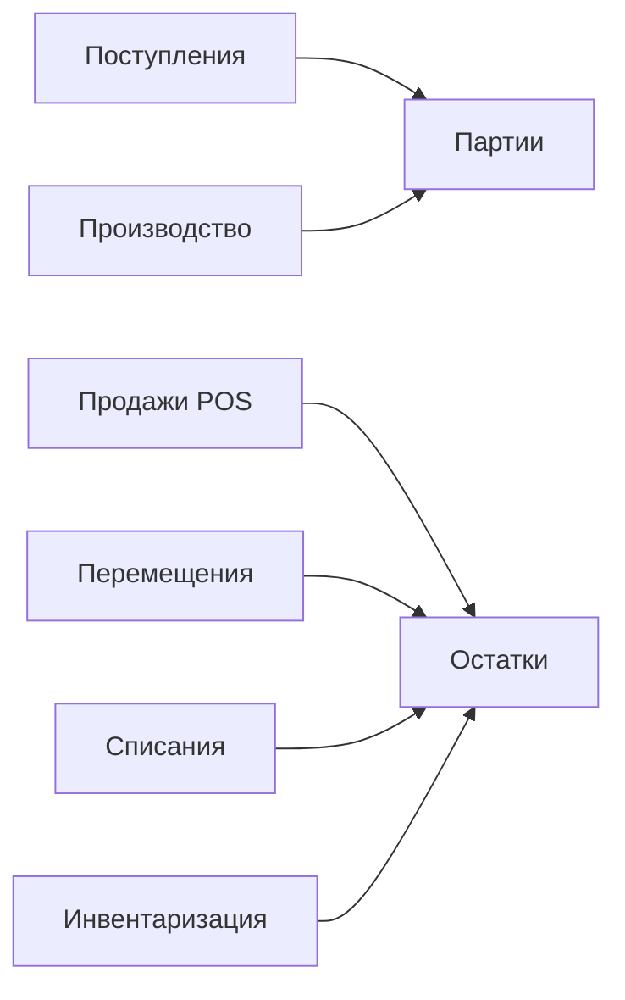

### Остатки и партии

**Назначение**: оперативный контроль складских остатков и партий.

**Функции**
- Просмотр по складам, категориям, партиям и срокам годности
- Трассировка движения по документам (сквозной drill-down)
- Расчёт средневзвешенной себестоимости

### Схема

