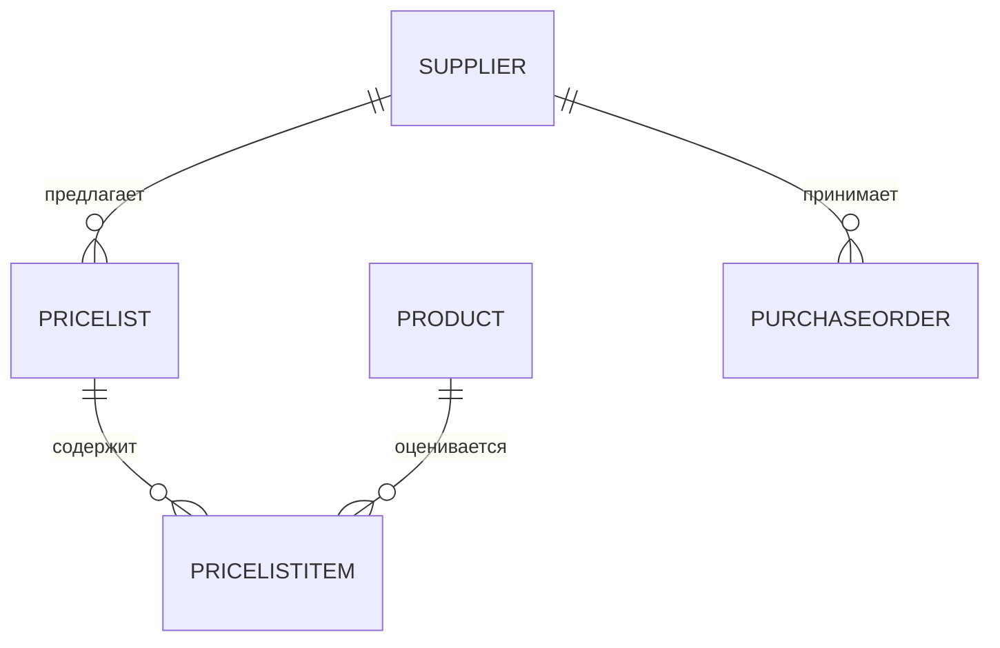

### Поставщики

**Назначение**: справочник контрагентов для закупок и поступлений.

**Функции**
- Карточка поставщика: реквизиты, контакты, валюта, условия
- Прайс-листы: матрица товаров и цен, даты действия
- SLA и логистика: дни поставок, минимальные партии, графики

### Схема

### Сценарии
- Импорт прайс-листа из Excel
- Сравнение цен нескольких поставщиков
- Блокировка поставщика (чёрный список)

