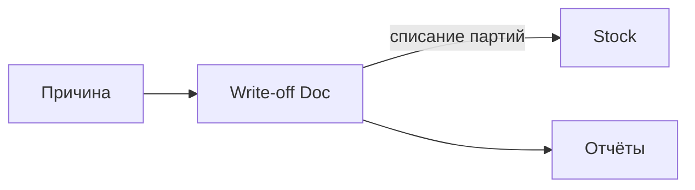

### Списания

**Назначение**: оформление потерь, брака, утилизации.

**Функции**
- Причины списания (настройки), статусы
- Выбор партий FEFO/FIFO, печатные формы

### Схема

### Валидации
- Контроль прав на списание
- Запрет списаний ниже нуля

