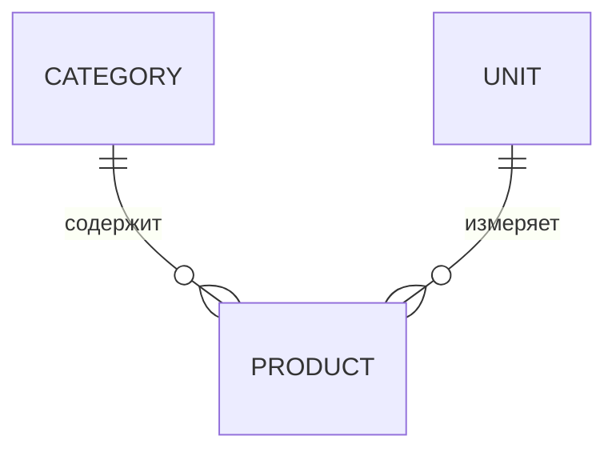

### Справочники (MDM) — MVP

Функции:
- `Product`, `Category`, `Unit` — CRUD
- Импорт/экспорт CSV
- Базовые проверки связей (запрет удаления используемых сущностей)

User stories:
- Технолог создает продукт с единицей и категорией, обновляет масса/объем, экспортирует CSV.

Backend API:
- GET /mdm/products, POST /mdm/products
- GET /mdm/categories, POST /mdm/categories
- GET /mdm/units

Валидации: уникальный SKU, коэффициенты пересчёта > 0, запрет удаления если используется в рецептах/партиях.

