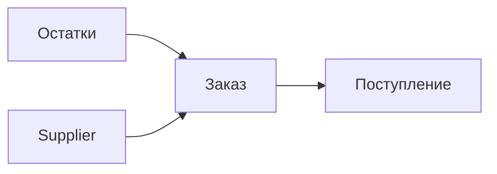

### Закупки — MVP

Функции:
- Заказ поставщику из остатков/минимальных уровней
- Подтверждение цен против прайс-листа
- Статусы: Черновик → Отправлен → Получен (частично/полностью)

User stories:
- Кладовщик формирует заказ по минимальным остаткам → отправляет поставщику → принимает частично.

Backend API:
- POST /purchases/orders {supplierId, items:[{sku, qty}]}
- GET /purchases/orders/{id}
- POST /purchases/orders/{id}/send
- POST /purchases/orders/{id}/receive {items:[{sku, qty, price}]}

Валидации: цена по прайсу ±5%, кратность упаковки.
