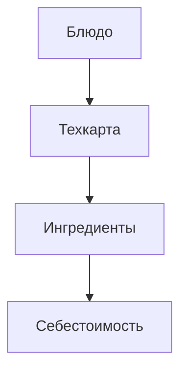

### Техкарты — MVP

Функции:
- Состав (ингредиент + количество + потери)
- Автосчёт себестоимости по средневзвешенной
- Печатная форма техкарты

User stories:
- Технолог создает техкарту блюда с 3 ингредиентами и фиксирует потери; получает себестоимость.

Backend API:
- GET /recipes?productId
- POST /recipes {productId, items:[{sku, qty, loss%}]}
- GET /recipes/{id}/print (PDF)

Валидации: циклические ссылки запрещены; единицы совместимы (пересчет по коэффициентам).
