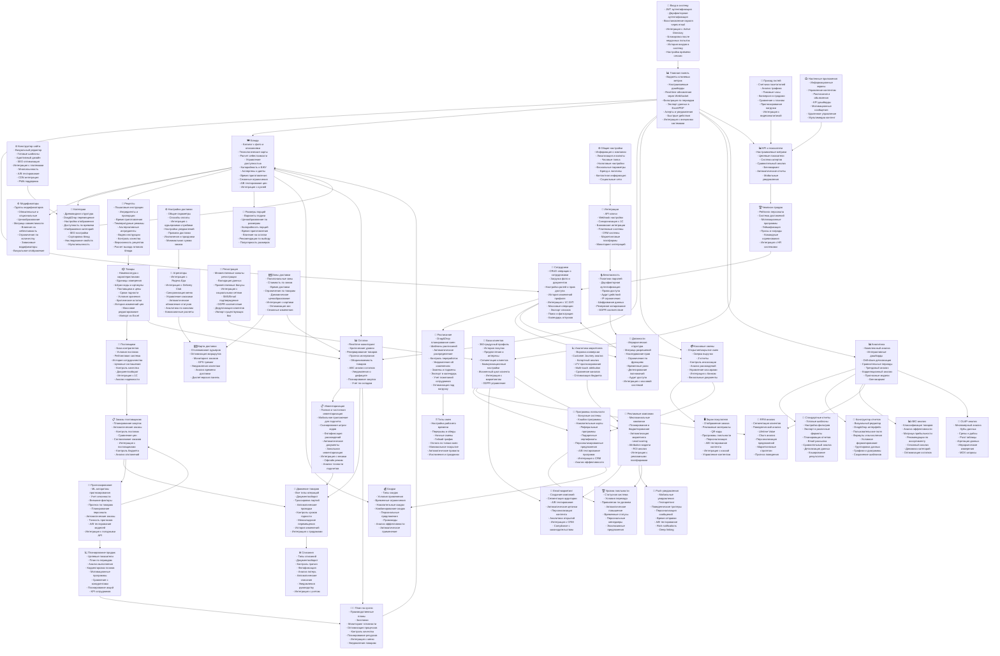

# Диаграмма архитектуры системы iiko-web

```mermaid
graph TD
    %% Аутентификация
    LOGIN[🔐 Вход в систему<br/>- JWT аутентификация<br/>- Двухфакторная аутентификация<br/>- Восстановление пароля через email<br/>- Интеграция с Active Directory<br/>- Блокировка после неудачных попыток<br/>- История входов в систему<br/>- Настройка времени сессии]

    %% Главная панель
    DASHBOARD[📊 Главная панель<br/>- Виджеты ключевых метрик<br/>- Настраиваемые дашборды<br/>- Real-time обновления через WebSocket<br/>- Фильтрация по периодам<br/>- Экспорт данных в Excel/PDF<br/>- Алерты и уведомления<br/>- Быстрые действия<br/>- Интеграция с внешними системами]

    %% Персонал
    STAFF_EMPLOYEES[👥 Сотрудники<br/>- CRUD операции с сотрудниками<br/>- Загрузка фото и документов<br/>- Настройка ролей и прав доступа<br/>- История изменений профиля<br/>- Интеграция с 1C:ЗУП<br/>- Массовые операции<br/>- Экспорт списков<br/>- Поиск и фильтрация<br/>- Календарь отпусков]

    STAFF_SCHEDULE[📅 Расписание<br/>- Drag&Drop планирование смен<br/>- Шаблоны расписаний<br/>- Автоматическое распределение<br/>- Контроль переработок<br/>- Уведомления об изменениях<br/>- Замены и подмены<br/>- Экспорт в календарь<br/>- Учет пожеланий сотрудников<br/>- Оптимизация под нагрузку]

    STAFF_POSITIONS[🎯 Должности<br/>- Иерархическая структура<br/>- Матрица разрешений<br/>- Наследование прав<br/>- Ограничения по функциям<br/>- Временные роли<br/>- Делегирование полномочий<br/>- Аудит доступа<br/>- Интеграция с кассовой системой]

    STAFF_SHIFTS[⏰ Типы смен<br/>- Настройка рабочего времени<br/>- Перерывы и обеды<br/>- Ночные смены<br/>- Гибкий график<br/>- Оплата по типам смен<br/>- Минимальное покрытие<br/>- Автоматические правила<br/>- Исключения и праздники]

    %% Меню
    MENU_DISHES[🍽️ Блюда<br/>- Каталог с фото и описаниями<br/>- Технологические карты<br/>- Расчет себестоимости<br/>- Управление доступностью<br/>- Калорийность и БЖУ<br/>- Аллергены и диеты<br/>- Время приготовления<br/>- Сезонные ограничения<br/>- A/B тестирование цен<br/>- Интеграция с кухней]

    MENU_PRODUCTS[📦 Товары<br/>- Номенклатура с характеристиками<br/>- Единицы измерения<br/>- Штрих-коды и артикулы<br/>- Поставщики и цены<br/>- Сроки годности<br/>- Условия хранения<br/>- Критические остатки<br/>- История изменений цен<br/>- Массовое редактирование<br/>- Импорт из Excel]

    MENU_CATEGORIES[📂 Категории<br/>- Древовидная структура<br/>- Drag&Drop перемещение<br/>- Настройки отображения<br/>- Доступность по времени<br/>- Изображения категорий<br/>- SEO настройки<br/>- Сортировка блюд<br/>- Наследование свойств<br/>- Мультиязычность]

    MENU_MODIFIERS[⚙️ Модификаторы<br/>- Группы модификаторов<br/>- Обязательные и опциональные<br/>- Ценообразование<br/>- Матрица совместимости<br/>- Влияние на себестоимость<br/>- Ограничения по количеству<br/>- Зависимые модификаторы<br/>- Визуальное отображение]

    MENU_DISCOUNTS[💰 Скидки<br/>- Типы скидок<br/>- Условия применения<br/>- Временные ограничения<br/>- Накопительные скидки<br/>- Комбинирование скидок<br/>- Персональные предложения<br/>- Промокоды<br/>- Анализ эффективности<br/>- Автоматическое применение]

    MENU_PORTIONS[📏 Размеры порций<br/>- Варианты подачи<br/>- Ценообразование по размерам<br/>- Калорийность порций<br/>- Время приготовления<br/>- Влияние на остатки<br/>- Рекомендации по выбору<br/>- Популярность размеров]

    MENU_RECIPES[📝 Рецепты<br/>- Пошаговые инструкции<br/>- Ингредиенты и пропорции<br/>- Время приготовления<br/>- Температурные режимы<br/>- Альтернативные ингредиенты<br/>- Видео инструкции<br/>- Контроль качества<br/>- Версионность рецептов<br/>- Расчет выхода готового блюда]

    %% Склад
    WAREHOUSE_INVENTORY[📋 Инвентаризация<br/>- Полная и частичная инвентаризация<br/>- Мобильное приложение для подсчета<br/>- Сканирование штрих-кодов<br/>- Фотофиксация расхождений<br/>- Автоматические документы<br/>- Зональная инвентаризация<br/>- Интеграция с весами<br/>- Офлайн режим<br/>- Анализ точности подсчетов]

    WAREHOUSE_STOCK[📊 Остатки<br/>- Real-time мониторинг<br/>- Критические уровни<br/>- Резервирование товаров<br/>- Прогноз исчерпания<br/>- Оборачиваемость товаров<br/>- ABC анализ остатков<br/>- Уведомления о дефиците<br/>- Планирование закупок<br/>- Учет по складам]

    WAREHOUSE_SUPPLIERS[🏢 Поставщики<br/>- База контрагентов<br/>- Условия поставок<br/>- Рейтинговая система<br/>- История сотрудничества<br/>- Ценовые соглашения<br/>- Контроль качества<br/>- Документооборот<br/>- Интеграция с 1С<br/>- Анализ надежности]

    WAREHOUSE_MOVEMENTS[🔄 Движение товаров<br/>- Все типы операций<br/>- Документооборот<br/>- Трассировка партий<br/>- Автоматические проводки<br/>- Контроль сроков годности<br/>- Межскладские перемещения<br/>- История изменений<br/>- Интеграция с продажами]

    WAREHOUSE_ORDERS[📋 Заказы поставщикам<br/>- Планирование закупок<br/>- Автоматические заказы<br/>- Контроль поставок<br/>- Сравнение цен<br/>- Согласование заказов<br/>- Интеграция с поставщиками<br/>- Контроль бюджета<br/>- Анализ отклонений]

    WAREHOUSE_WRITEOFFS[❌ Списания<br/>- Типы списаний<br/>- Документооборот<br/>- Контроль причин<br/>- Фотофиксация<br/>- Анализ потерь<br/>- Автоматические списания<br/>- Уведомления руководству<br/>- Интеграция с учетом]

    %% Продажи
    SALES_FORECASTING[🔮 Прогнозирование<br/>- ML алгоритмы прогнозирования<br/>- Учет сезонности<br/>- Внешние факторы<br/>- Прогноз по товарам<br/>- Планирование персонала<br/>- Автоматические заказы<br/>- Точность прогнозов<br/>- A/B тестирование моделей<br/>- Интеграция с погодными API]

    SALES_PLANNING[📈 Планирование продаж<br/>- Целевые показатели<br/>- План по периодам<br/>- Анализ выполнения<br/>- Корректировки планов<br/>- Мотивационные программы<br/>- Сравнение с конкурентами<br/>- Планирование акций<br/>- KPI сотрудников]

    SALES_SHIFTS[💳 Кассовые смены<br/>- Открытие/закрытие смен<br/>- Сверка выручки<br/>- Z-отчеты<br/>- Контроль инкассации<br/>- Анализ расхождений<br/>- Управление кассирами<br/>- Интеграция с банком<br/>- Фискальные документы]

    SALES_KITCHEN[👨‍🍳 План на кухню<br/>- Производственные планы<br/>- Заготовки<br/>- Мониторинг готовности<br/>- Оптимизация процессов<br/>- Контроль качества<br/>- Планирование ресурсов<br/>- Интеграция с меню<br/>- Уведомления поварам]

    SALES_DISPLAY[🖥️ Экран покупателя<br/>- Отображение заказа<br/>- Рекламные материалы<br/>- QR-коды<br/>- Программы лояльности<br/>- Персонализация<br/>- A/B тестирование контента<br/>- Интеграция с кассой<br/>- Управление контентом]

    %% Отчеты
    REPORTS_STANDARD[📄 Стандартные отчеты<br/>- Готовые шаблоны<br/>- Настройка фильтров<br/>- Экспорт в различные форматы<br/>- Планировщик отчетов<br/>- Email рассылка<br/>- Сравнительный анализ<br/>- Детализация данных<br/>- Кэширование результатов]

    REPORTS_BUILDER[🔧 Конструктор отчетов<br/>- Визуальный редактор<br/>- Drag&Drop интерфейс<br/>- Пользовательские поля<br/>- Формулы и вычисления<br/>- Условное форматирование<br/>- Группировка данных<br/>- Графики и диаграммы<br/>- Сохранение шаблонов]

    REPORTS_ANALYTICS[📊 Аналитика<br/>- Комплексный анализ<br/>- Интерактивные дашборды<br/>- Drill-down детализация<br/>- Сравнительные периоды<br/>- Трендовый анализ<br/>- Корреляционный анализ<br/>- Прогнозные модели<br/>- Бенчмаркинг]

    REPORTS_ABC[📊 ABC-анализ<br/>- Классификация товаров<br/>- Анализ эффективности<br/>- Матрица прибыльности<br/>- Рекомендации по ассортименту<br/>- Сезонный анализ<br/>- Динамика категорий<br/>- Оптимизация остатков]

    REPORTS_RFM[👥 RFM-анализ<br/>- Сегментация клиентов<br/>- Поведенческий анализ<br/>- Lifetime Value<br/>- Churn анализ<br/>- Персонализация предложений<br/>- Маркетинговые стратегии<br/>- Прогноз поведения]

    REPORTS_OLAP[🧊 OLAP-анализ<br/>- Многомерный анализ<br/>- Кубы данных<br/>- Срезы и дайсы<br/>- Pivot таблицы<br/>- Агрегация данных<br/>- Иерархические измерения<br/>- MDX запросы]

    %% Лояльность
    LOYALTY_REGISTRATION[📝 Регистрация<br/>- Множественные каналы регистрации<br/>- Валидация данных<br/>- Приветственные бонусы<br/>- Интеграция с социальными сетями<br/>- SMS/Email подтверждение<br/>- GDPR соответствие<br/>- Дедупликация клиентов<br/>- Импорт существующих баз]

    LOYALTY_PROGRAMS[🎁 Программы лояльности<br/>- Бонусные системы<br/>- Кэшбэк программы<br/>- Накопительные карты<br/>- Реферальные программы<br/>- Подарочные сертификаты<br/>- Персонализированные предложения<br/>- A/B тестирование программ<br/>- Интеграция с CRM<br/>- Анализ эффективности]

    LOYALTY_CUSTOMERS[👤 База клиентов<br/>- 360-градусный профиль<br/>- История покупок<br/>- Предпочтения и интересы<br/>- Сегментация клиентов<br/>- Коммуникационные настройки<br/>- Жизненный цикл клиента<br/>- Интеграция с маркетингом<br/>- GDPR управление]

    LOYALTY_TIERS[🏆 Уровни лояльности<br/>- Статусная система<br/>- Условия перехода<br/>- Привилегии по уровням<br/>- Автоматическое повышение<br/>- Временные статусы<br/>- Персональные менеджеры<br/>- Эксклюзивные предложения]

    %% Маркетинг
    MARKETING_EMAIL[📧 Email-маркетинг<br/>- Создание кампаний<br/>- Сегментация аудитории<br/>- A/B тестирование<br/>- Автоматические цепочки<br/>- Персонализация контента<br/>- Аналитика открытий<br/>- Интеграция с CRM<br/>- Compliance с законодательством]

    MARKETING_PUSH[📱 Push-уведомления<br/>- Мобильные уведомления<br/>- Геотаргетинг<br/>- Поведенческие триггеры<br/>- Персонализация сообщений<br/>- Время отправки<br/>- A/B тестирование<br/>- Rich notifications<br/>- Deep linking]

    MARKETING_CAMPAIGNS[📢 Рекламные кампании<br/>- Многоканальные кампании<br/>- Планирование и бюджетирование<br/>- Автоматизация маркетинга<br/>- Lead scoring<br/>- Attribution модели<br/>- ROI анализ<br/>- Интеграция с рекламными платформами]

    MARKETING_ANALYTICS[📈 Аналитика маркетинга<br/>- Воронка конверсии<br/>- Customer Journey анализ<br/>- Когортный анализ<br/>- LTV прогнозирование<br/>- Multi-touch attribution<br/>- Сравнение каналов<br/>- Оптимизация бюджета]

    %% Доставка
    DELIVERY_CONSTRUCTOR[🌐 Конструктор сайта<br/>- Визуальный редактор<br/>- Готовые шаблоны<br/>- Адаптивный дизайн<br/>- SEO оптимизация<br/>- Интеграция с платежами<br/>- Многоязычность<br/>- A/B тестирование<br/>- CDN интеграция<br/>- PWA поддержка]

    DELIVERY_ZONES[🗺️ Зоны доставки<br/>- Полигональные зоны<br/>- Стоимость по зонам<br/>- Время доставки<br/>- Ограничения по товарам<br/>- Динамическое ценообразование<br/>- Интеграция с картами<br/>- Оптимизация зон<br/>- Сезонные изменения]

    DELIVERY_SETTINGS[⚙️ Настройки доставки<br/>- Общие параметры<br/>- Способы оплаты<br/>- Интеграция с курьерскими службами<br/>- Настройка уведомлений<br/>- Правила доставки<br/>- Исключения и праздники<br/>- Минимальная сумма заказа]

    DELIVERY_AGGREGATORS[🛵 Агрегаторы<br/>- Интеграция с Яндекс.Еда<br/>- Интеграция с Delivery Club<br/>- Синхронизация меню<br/>- Управление заказами<br/>- Автоматическое обновление статусов<br/>- Аналитика по каналам<br/>- Комиссионные расчеты]

    DELIVERY_MAP[🗺️ Карта доставки<br/>- Отслеживание курьеров<br/>- Оптимизация маршрутов<br/>- Мониторинг заказов<br/>- GPS трекинг<br/>- Уведомления клиентам<br/>- Анализ времени доставки<br/>- Диспетчерская панель]

    %% Модули
    MODULES_ARRIVALS[🚶 Приход гостей<br/>- Счетчики посетителей<br/>- Анализ трафика<br/>- Пиковые часы<br/>- Конверсия в продажи<br/>- Сравнение с планом<br/>- Прогнозирование нагрузки<br/>- Интеграция с видеоаналитикой]

    MODULES_KPI[📊 KPI и показатели<br/>- Настраиваемые метрики<br/>- Целевые показатели<br/>- Система алертов<br/>- Сравнительный анализ<br/>- Бенчмаркинг<br/>- Автоматические отчеты<br/>- Мобильные уведомления]

    MODULES_CHAMPION[🏆 Чемпион продаж<br/>- Рейтинги персонала<br/>- Система достижений<br/>- Мотивационные программы<br/>- Геймификация<br/>- Призы и награды<br/>- Командные соревнования<br/>- Интеграция с HR системами]

    MODULES_WALL[📺 Настенные приложения<br/>- Информационные экраны<br/>- Управление контентом<br/>- Расписания и объявления<br/>- KPI дашборды<br/>- Мотивационные сообщения<br/>- Удаленное управление<br/>- Мультимедиа контент]

    %% Настройки
    SETTINGS_GENERAL[⚙️ Общие настройки<br/>- Информация о компании<br/>- Локализация и валюты<br/>- Часовые пояса<br/>- Налоговые настройки<br/>- Фискальные параметры<br/>- Бренд и логотипы<br/>- Контактная информация<br/>- Социальные сети]

    SETTINGS_INTEGRATIONS[🔌 Интеграции<br/>- API ключи<br/>- Webhook настройки<br/>- Синхронизация с 1С<br/>- Банковские интеграции<br/>- Платежные системы<br/>- CRM системы<br/>- Маркетинговые платформы<br/>- Мониторинг интеграций]

    SETTINGS_SECURITY[🔒 Безопасность<br/>- Политики паролей<br/>- Двухфакторная аутентификация<br/>- Права доступа<br/>- Аудит действий<br/>- IP ограничения<br/>- Шифрование данных<br/>- Резервное копирование<br/>- GDPR соответствие]

    %% Основные связи
    LOGIN --> DASHBOARD

    %% Связи от Dashboard
    DASHBOARD --> STAFF_EMPLOYEES
    DASHBOARD --> MENU_DISHES
    DASHBOARD --> WAREHOUSE_STOCK
    DASHBOARD --> SALES_SHIFTS
    DASHBOARD --> REPORTS_ANALYTICS
    DASHBOARD --> LOYALTY_CUSTOMERS
    DASHBOARD --> MODULES_KPI

    %% Связи модуля Персонал
    STAFF_EMPLOYEES --> STAFF_SCHEDULE
    STAFF_EMPLOYEES --> STAFF_POSITIONS
    STAFF_SCHEDULE --> STAFF_SHIFTS
    STAFF_POSITIONS --> STAFF_EMPLOYEES

    %% Связи модуля Меню
    MENU_DISHES --> MENU_CATEGORIES
    MENU_DISHES --> MENU_MODIFIERS
    MENU_DISHES --> MENU_RECIPES
    MENU_DISHES --> MENU_PORTIONS
    MENU_RECIPES --> MENU_PRODUCTS
    MENU_PRODUCTS --> WAREHOUSE_SUPPLIERS
    MENU_CATEGORIES --> MENU_DISHES
    MENU_DISHES --> MENU_DISCOUNTS

    %% Связи модуля Склад
    WAREHOUSE_STOCK --> WAREHOUSE_INVENTORY
    WAREHOUSE_STOCK --> WAREHOUSE_MOVEMENTS
    WAREHOUSE_SUPPLIERS --> WAREHOUSE_ORDERS
    WAREHOUSE_ORDERS --> WAREHOUSE_MOVEMENTS
    WAREHOUSE_MOVEMENTS --> WAREHOUSE_WRITEOFFS
    WAREHOUSE_INVENTORY --> WAREHOUSE_MOVEMENTS

    %% Связи модуля Продажи
    SALES_FORECASTING --> SALES_PLANNING
    SALES_FORECASTING --> WAREHOUSE_ORDERS
    SALES_PLANNING --> SALES_KITCHEN
    SALES_KITCHEN --> MENU_DISHES
    SALES_SHIFTS --> SALES_DISPLAY

    %% Связи модуля Отчеты
    REPORTS_ANALYTICS --> REPORTS_STANDARD
    REPORTS_ANALYTICS --> REPORTS_BUILDER
    REPORTS_ANALYTICS --> REPORTS_ABC
    REPORTS_ANALYTICS --> REPORTS_RFM
    REPORTS_ANALYTICS --> REPORTS_OLAP

    %% Связи модуля Лояльность
    LOYALTY_REGISTRATION --> LOYALTY_CUSTOMERS
    LOYALTY_CUSTOMERS --> LOYALTY_PROGRAMS
    LOYALTY_PROGRAMS --> LOYALTY_TIERS
    LOYALTY_CUSTOMERS --> REPORTS_RFM

    %% Связи модуля Маркетинг
    MARKETING_CAMPAIGNS --> MARKETING_EMAIL
    MARKETING_CAMPAIGNS --> MARKETING_PUSH
    MARKETING_ANALYTICS --> MARKETING_CAMPAIGNS
    LOYALTY_CUSTOMERS --> MARKETING_EMAIL

    %% Связи модуля Доставка
    DELIVERY_CONSTRUCTOR --> MENU_CATEGORIES
    DELIVERY_ZONES --> DELIVERY_MAP
    DELIVERY_SETTINGS --> DELIVERY_AGGREGATORS
    DELIVERY_AGGREGATORS --> DELIVERY_MAP

    %% Связи модулей
    MODULES_ARRIVALS --> MODULES_KPI
    MODULES_KPI --> MODULES_CHAMPION
    MODULES_CHAMPION --> STAFF_EMPLOYEES
    MODULES_WALL --> MODULES_KPI

    %% Связи настроек
    SETTINGS_GENERAL --> SETTINGS_INTEGRATIONS
    SETTINGS_INTEGRATIONS --> SETTINGS_SECURITY
    SETTINGS_SECURITY --> STAFF_POSITIONS

    %% Межмодульные связи
    MENU_DISHES --> WAREHOUSE_STOCK
    WAREHOUSE_STOCK --> SALES_KITCHEN
    SALES_SHIFTS --> LOYALTY_PROGRAMS
    LOYALTY_CUSTOMERS --> MARKETING_CAMPAIGNS
    STAFF_EMPLOYEES --> SALES_SHIFTS
    WAREHOUSE_ORDERS --> SALES_FORECASTING
    MENU_PRODUCTS --> WAREHOUSE_STOCK
    LOYALTY_PROGRAMS --> MENU_DISCOUNTS
    MARKETING_CAMPAIGNS --> LOYALTY_TIERS
    DELIVERY_ZONES --> WAREHOUSE_STOCK
```
